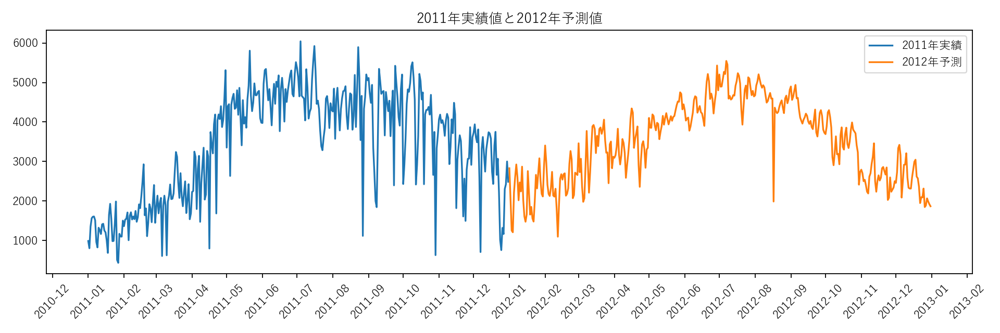
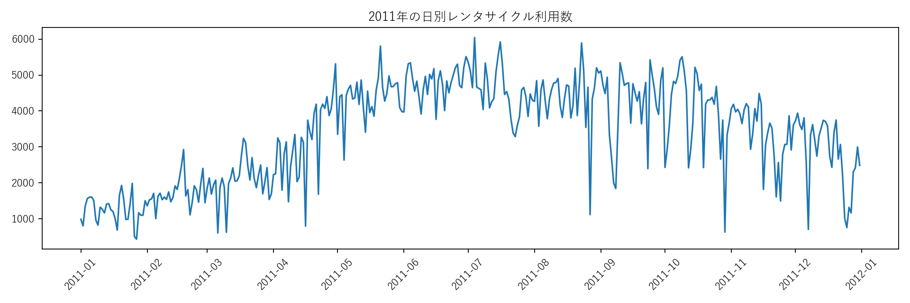

# レンタサイクル需要予測

[](https://github.com/23610252hoang/bike-sharing-demand-prediction/actions/workflows/python-app.yml)
[](LICENSE)

日別のレンタサイクル利用データを用いて、翌年の利用数を予測する機械学習プロジェクトです。2011年の学習データから需要傾向を学習し、2012年の日別需要を予測します。

精度を最大化するだけでなく、データ確認、前処理、検証、予測CSV出力までの一連の流れを再現できるように整理しました。

## 分析結果のイメージ





## 開発背景・完成までの流れ

- 需要予測の基本的な流れを理解するため、日別レンタサイクルデータを題材にしました。
- まず欠損値、データ型、基本統計量を確認し、日付順に並べて時系列として扱えるようにしました。
- 2011年データの後半20%を検証用に分け、学習データと検証データを時系列順に分割しました。
- ベースラインとして線形回帰を採用し、体感温度 `atemp` を特徴量にして需要数を予測しました。
- 検証指標としてRMSEとMAEを出力し、最後に2012年データの予測結果をCSVとして保存します。

## 主なファイル

- `bike_sharing_local.py`: データ読み込み、前処理、学習、検証、予測CSV出力を行うPythonスクリプト
- `day_train.csv`: 2011年の学習データ
- `day_test.csv`: 2012年の予測対象データ
- `23610252kn_pred.csv`: 提出・参照用の予測結果
- `requirements.txt`: 必要なPythonライブラリ

履歴書PDFや一時的なbase64ファイルは、公開用ポートフォリオに不要なため含めていません。

## 使用技術

- Python
- pandas: CSV読み込み、データ整形、欠損値確認
- NumPy: 数値計算
- scikit-learn: 線形回帰モデル、RMSE/MAE評価
- Matplotlib / seaborn: 可視化
- Git / GitHub: バージョン管理・成果物提出

## 処理フロー


## 課題と解決

| 課題 | 対応 | 学んだこと |
| --- | --- | --- |
| 将来データを使った評価漏れを避けたい | ランダム分割ではなく、日付順の後半20%を検証に使用 | 時系列データでは分割方法が評価の信頼性に影響する |
| 最初から複雑なモデルにすると改善理由が分かりにくい | `atemp` だけを使う線形回帰をベースラインに設定 | 単純な基準モデルが比較と説明に役立つ |
| 結果を数値だけでなく確認したい | 実績値と予測値の時系列グラフを自動保存 | 可視化により季節性と予測傾向を説明しやすくなる |
| 他の環境でも実行できる形にしたい | 相対パス、`requirements.txt`、CLIオプションを用意 | 再現性はモデル精度と同様に重要である |

## アピールできるスキル

- CSVデータの読み込みと前処理
- 時系列を意識したtrain/validation分割
- scikit-learnによる機械学習モデル構築
- RMSE/MAEによるモデル評価
- 予測結果を提出形式CSVに変換する処理
- READMEと再現手順を含めたポートフォリオ整理

## ビジネス的な価値

- 自転車レンタル需要を予測することで、車両配置やスタッフ配置の計画に活用できます。
- 天候や気温などの外部要因が需要に与える影響を分析するきっかけになります。
- 需要が高い日を事前に把握することで、在庫不足や機会損失を減らせます。
- 小さなベースラインモデルから改善を重ねる実務的な分析プロセスを示しています。

## 手法

- モデル: scikit-learnの `LinearRegression`
- 特徴量: 正規化された体感温度 `atemp`
- 検証方法: 2011年データの後半20%を時系列順に検証データとして使用
- 出力: `instant` と予測 `count` を含むCSV

このリポジトリは、モデルの複雑さよりも、分析手順の明確さと再現性を重視しています。

## 実行方法

依存ライブラリをインストールします。

```bash
pip install -r requirements.txt
```

スクリプトを実行します。

```bash
python bike_sharing_local.py
```

グラフ保存を省略して素早く確認する場合:

```bash
python bike_sharing_local.py --skip-plots
```

予測結果は `submissions/`、グラフは `figures/` に出力されます。これらの生成フォルダはGit管理対象外です。

## 出力例

同梱している予測ファイルの先頭例:

```csv
dteday,cnt
2012/1/1,3367.74
2012/1/2,2883.61
2012/1/3,3596.46
```

`bike_sharing_local.py` を実行した場合の提出用フォーマット:

```csv
instant,count
366,2828
367,2048
368,1250
```

## 動作確認

```bash
python bike_sharing_local.py --skip-plots
```

確認項目:

- 学習データ365行、予測対象366行を読み込めること
- 欠損値確認と検証指標が表示されること
- `submissions/` に予測CSVが生成されること
- グラフ実行時に `figures/` へPNGが保存されること

## 面接で説明できるポイント

- なぜランダム分割ではなく時系列順に分割したか
- なぜ最初に線形回帰を選んだか
- RMSEとMAEがそれぞれ何を表すか
- 現在のモデルの限界と、季節・曜日・天候を追加する改善案


## ライセンス

本リポジトリで作成したソースコードとドキュメントは [MIT License](LICENSE) です。第三者データはMIT Licenseの対象外で、それぞれの利用条件に従います。
